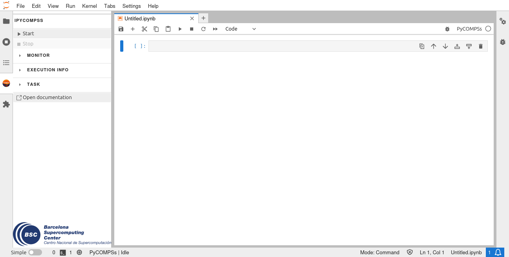

.. PyCOMPSs Jupyter extensions documentation master file, created by
   sphinx-quickstart on Tue Apr  4 18:59:17 2023.
   You can adapt this file completely to your liking, but it should at least
   contain the root `toctree` directive.

#########################################
PyCOMPSs Jupyter extensions documentation
#########################################

The PyCOMPSs Jupyter extensions are a group of extensions consisting of a Jupyter kernel and
a JupyterLab extension that are developed to improve the integration that PyCOMPSs has in such
environment. This documentation is divided in 3 sections: one for the installation of the
extensions and another one for each of them. Its index can be found at the end of this page.

|

.. toctree::
   :maxdepth: 1
   :caption: Installing

   install/install

.. toctree::
   :maxdepth: 1
   :caption: IPyCOMPSs kernel
   
   pycompss_jupyter_kernel/overview
   pycompss_jupyter_kernel/start_stop

.. toctree::
   :maxdepth: 1
   :caption: IPyCOMPSs JupyterLab extension

   pycompss_jupyterlab_extension/overview
   pycompss_jupyterlab_extension/start_stop
   pycompss_jupyterlab_extension/monitor
   pycompss_jupyterlab_extension/execution_info
   pycompss_jupyterlab_extension/decorator
   pycompss_jupyterlab_extension/reference
