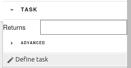
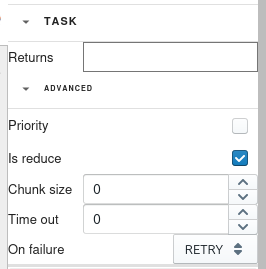

Generating decorators
=====================

Clicking on the 'task' button will show a drop-down list with parameters that the decorator
accepts.

Clicking the 'Advanced options' button will reveal more decorator parameters. Clicking
it again will hide them.

To define a new decorator, fill in the desired values of the parameters, place the cursor on
the function you wish to apply the decorator and click the 'Define task' button. If some
parameters that depend on the function chosen are detected, a pop-up asking you to fill them
will be shown.

After pressing the 'Define task' in the pop-up or after pressing it in the drop-down list
when no extra parameters are detected a decorator will be generated and placed over the
selected function.

.. attention::
    Closing the drop-down list will wipe out the current values of the parameters.

.. caution::
    For the 'task' decorator, the detected parameters are the function arguments. However,
    these will not be detected correctly if a variable is used as a default value for an
    argument.
