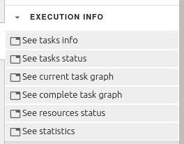
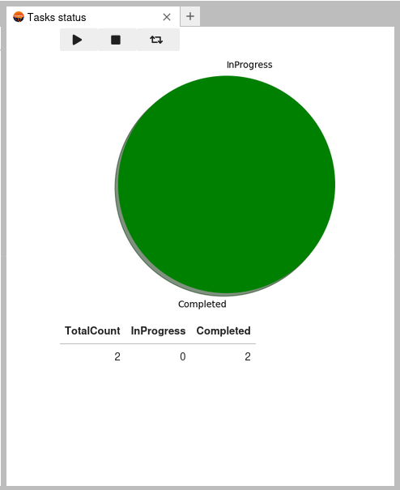

Showing the execution info
==========================

Clicking on the 'execution info' button will show a drop-down list with the following buttons:
'See tasks info', 'See tasks status', 'See current task graph', 'See complete task graph',
'See resources status' and 'See statistics'.

Clicking any of these buttons will open a panel with the corresponding information of the
running PyCOMPSs application. This will only be available if there is a notebook using the
IPyCOMPSs kernel on focus and that particular panel is not already open.

Even if the above conditions are met, it is possible that there is no data to be displayed.
In that scenario, a suitable message will appear in the panel.

All the panels show a play button that when clicked will update the information shown
periodically. The exceptions to this are the 'See current task graph' and 'See complete task
graph'. The first one will always be updated periodically and the second one is never updated.