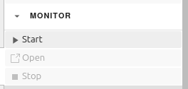

Starting, opening and stopping the PyCOMPSs monitor
===================================================

Managing the monitor
--------------------

If more information than the one shown in the execution info panels is needed, the extension
also provides the option to start, open and stop the PyCOMPSs monitor. At the moment, the
monitor can only be used locally, so if the environment variable ``COMPSS_RUNNING_IN_SC``
is set to true, all the monitor buttons will be disabled.

Clicking the 'monitor' button will show a drop-down list with three buttons: 'Start', 'Open'
and 'Stop'. When a notebook with the IPyCOMPSs kernel is in focus and the monitor has not been
started, the start button will be enabled.

Clicking the 'start' button will start the monitor and open it in a new browser tab. After
being opened successfully, the 'open' and 'stop' buttons will be enabled. Clicking the 'open'
button will open the monitor in a new tab and clicking the 'stop' button will stop the monitor.