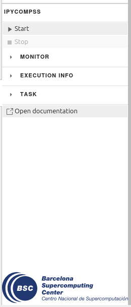

Overview
========

The IPyCOMPSs (Interactive Python binding of COMPSs) JupyterLab extension supplies a new tab
in the left sidebar of the JupyterLab UI. It contains buttons that allow to automatically
generate the PyCOMPSs decorators from the parameter values that the user has input and also
open the PyCOMPSs reference. There are also other buttons that work with the PyCOMPSs Jupyter
kernel to start and stop the PyCOMPSs runtime, to open the PyCOMPSs monitor and to show
information about the running application.

|
